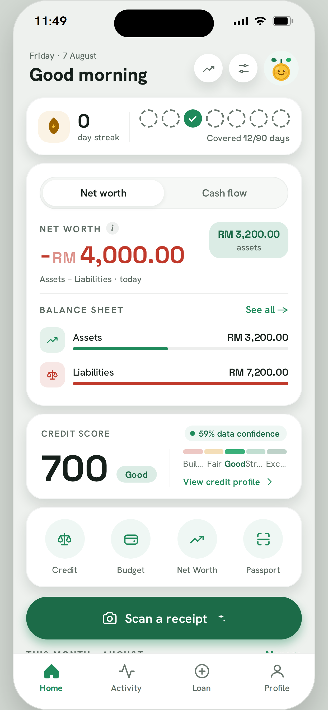
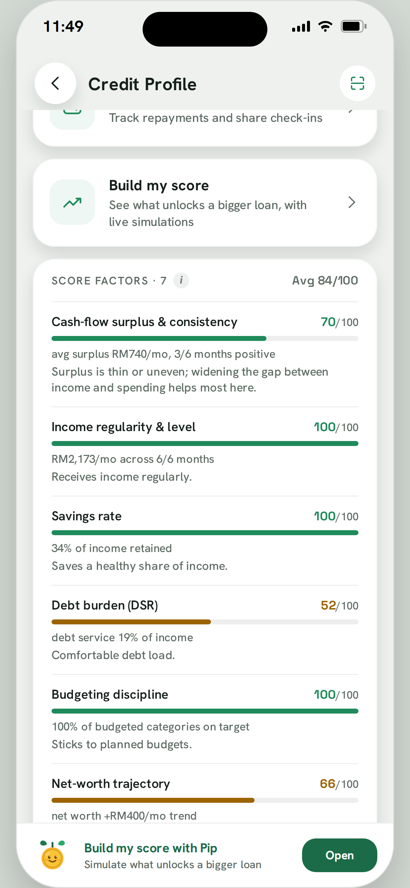

# PipComp: Pip Credit borrower app

It started as an AI expense tracker and grew into the full Pip Credit borrower experience:
tracking, a deterministic credit score, a fraud-checked confidence layer, a signed Credit
Passport, and a loans flow that talks to the Lender Console. Built with Expo (React Native)
+ TypeScript and on-device SQLite. For the product pitch and the system architecture, see the
[root README](../README.md).

---

## Screenshots

<table>
<tr>
<td align="center" width="33%">
 
<b>Dashboard</b>
</td>
<td align="center" width="33%">
 
<b>Credit Profile</b>
</td>
<td align="center" width="33%">
 
<b>Credit Passport</b>
</td>
</tr>
</table>

---

## Tracking your money

Attach a screenshot of a bank or e-wallet transaction history. A vision LLM (Groq, with a
Gemini fallback) reads each line into structured transactions, asks which category it
belongs to, and **learns**: the next time it sees the same merchant, it pre-fills the
category. Matching is exact but case/space-tolerant ("TEALIVE" and "Tealive" match; two
different tolls don't). Income rows are auto-tagged and never prompt or get learned.
Everything, including the learned merchant map, stays in local SQLite. No account, no cloud.

Beyond scanning: manual entry, statement import (PDF/CSV/Excel), a balance scan, budgets with
goals, net-worth tracking (assets and debts), recurring bills and DCA contributions, and a
monthly recap.

---

## How the credit score works

A **300–900** score built from **7 weighted factors**, each scored 0–100 and combined by
weight:

| Factor | Weight | What it measures |
| --- | --- | --- |
| Cash-flow surplus & consistency | 25% | Share of months with positive net cash flow, and surplus as a share of income |
| Income regularity & level | 20% | Share of months with any recorded income, and income level against a reference floor |
| Savings rate | 15% | Share of income retained, ramping to full marks at a 20% savings rate |
| Debt burden (DSR) | 15% | Monthly debt service against income; full marks at 0%, zero at a 40% debt-service ratio |
| Budgeting discipline | 10% | Share of budgeted categories kept on target |
| Track record | 10% | Repayment tenure and on-time ratio; a first-time borrower is never penalized for having no history yet |
| Net-worth trajectory | 5% | Monthly trend in net worth |

The weighted total is then **dampened by the data-confidence score** (see below), and the
*displayed* score is separately capped by confidence: below 30% confidence the score can't
show above 499 (Building), below 40% it caps at 619 (Fair), below 60% it caps at 819
(Strong), and only at 60%+ confidence can it reach the Excellent band (820+). A borrower
can't buy their way to a top score with unverifiable data alone.

---

## Guarding against fraud

Every score comes with a **data-confidence** percentage, built from several independent
signals rather than one trust switch:

- **Provenance**: verified data counts more than AI-extracted data, which counts more than
  manually typed data.
- **Benford's Law conformity**: real transaction amounts follow a predictable leading-digit
  distribution; fabricated ones usually don't.
- **Round-number ratio**: a heavy skew toward suspiciously round amounts (RM500, RM1,000...)
  is penalized.
- **Duplicate detection**: repeated merchant/amount/date rows are flagged.
- **Coverage**: how many of the last 90 days actually have recorded activity.

On top of that, a **trained fraud model** (logistic regression over 9 features including
Benford conformity, round-number ratio, transaction-gap patterns, merchant entropy, and
amount variability) outputs a fabrication probability that further discounts confidence, and
an implausibility check penalizes statements that show income but almost no matching
spending.

The layer that catches the cleverest fraud is a set of **five integrity checks** aimed
specifically at a fraudster who leaves 90% of their data genuine and injects just a few fake
income rows, exactly the pattern that barely moves any of the aggregate signals above:

1. **Running-balance reconciliation**: does each transaction's amount actually match the
   change in the stated running balance?
2. **Income point-anomaly detection**: does any single income entry statistically stick out
   from the rest, especially from a weak (manual, undocumented) source?
3. **Income-to-expense skew**: does income spike in a month while spending stays flat?
4. **Payer-entity alignment**: how much of the income comes from verifiable payers (bank
   transfers, registered businesses) versus generic, undocumented sources?
5. **Source-isolation gap**: is the income side of the ledger resting on a much weaker data
   pipeline than the expense side?

Two or more of these tripping at once caps the whole statement's confidence at 39%, below
the lender console's auto-approve threshold, forcing a human review instead of an automatic
decision either way.

### Attack Gallery

An in-app demo that runs six named, realistic fraud attempts through this exact pipeline, so
the defenses aren't just claimed, they're shown working:

1. **Injected salary spike**: two large fake "salary" deposits slipped into an otherwise
   genuine 90%-real statement.
2. **All-P2P income**: every income row disguised as an anonymous transfer, with no
   verifiable payer at all.
3. **Round-number fabrication**: hand-typed, suspiciously round transaction amounts.
4. **Income-only curated statement**: only income is uploaded, all spending is hidden, to
   look like a high earner with no outgoings.
5. **Ledger balance break**: a fake row is pasted into a bank statement without recomputing
   the running balance around it.
6. **Source-isolation gap**: authentic expenses paired with hand-typed, unverifiable income.

Each attack runs against the same otherwise-strong applicant profile, so only the
data-integrity layer decides whether it's caught, flagged, or missed. A **control run**, the
same honest data with no attack applied, is always shown approved alongside them, proving
the checks discriminate between real and fabricated data rather than just rejecting
everything.

---

## The Credit Passport

A cryptographically signed, portable credential a borrower can hand to any participating
lender. Raw transactions never leave the device; only pre-aggregated figures and a
cryptographic hash of them are shared. Sharing happens in **consent tiers**, each granted
separately:

- **Tier 0, Aggregates** (always included): score, band, the 7-factor breakdown, data
  confidence, 90-day coverage, income/surplus averages, debt service, repayment record,
  score momentum, and a Benford digit histogram, never individual transactions. Valid 30
  days.
- **Tier 1, Identity**: verified name, a masked IC number, and self-declared occupation.
  Valid 365 days.
- **Tier 2, Spending behaviour**: essential-spend ratio, expense volatility, cash-buffer
  days, savings rate, and itemised recurring obligations. The shortest-lived and most
  sensitive tier, valid 30 days.
- **Tier 3, Post-disbursement monitoring**: a standing consent to share updated aggregates
  while a loan is active, expiring with the loan's own term.

The passport is signed twice: once with the borrower's own **holder key**, proving the
contents weren't altered after signing, and once with Pip's **issuer key**, proving it was
actually issued by Pip and not self-minted. A lender verifies both signatures offline
against a pinned public key, with no network call and no shared database required.

---

## The Passport Builder Coach

Rather than guessing at advice, the coach **re-runs the real scoring and decision engines**
on hypothetical futures and reports the honest before-and-after:

- **More history**: simulate reaching the next data-coverage milestone.
- **Higher surplus**: simulate freeing up a specific amount of monthly spending, sized to
  the borrower's own budget and, where it helps, naming which discretionary category they
  spend most above a national reference benchmark on.
- **Track record**: simulate three months of on-time repayments.
- **Stress test**: simulate a 10/20/30% income dip to show whether a current offer would
  survive a downturn.

It also diagnoses which single constraint is actually holding a borrower back (thin data,
low confidence, or a tight surplus) by testing each one in isolation and reporting whichever
relaxation would help the most. When coaching toward a specific lender, it reads that
lender's own **published criteria** (score, confidence, and coverage thresholds), the same
numbers that lender's console applies, so the advice can never drift from what actually
gets approved there.

---

## Financing

Loan tiers get progressively larger and cheaper as a score climbs: **Emergency Micro** (a
safety net for thin files), **Starter Capital**, **Growth Capital**, and **Scale Capital**,
each with its own score floor, amount range, and rate. An approval is a standing offer: the
borrower always explicitly accepts or declines, and nothing books automatically. A personal
**borrowing limit** combines three independent signals: what the decision engine says is
affordable, a progression cap that grows with a track record of on-time repayments and
shrinks after a missed one, and any exposure already outstanding on other loans, so the
limit reflects the tightest of the three, with the app telling the borrower which one is
actually binding.

---

## Identity verification (eKYC)

Structural validation of a Malaysian NRIC (MyKad) number: parsing the date of birth,
resolving the state of birth from the format code, and deriving gender from the check digit,
then masking everything but the last four digits for display. This build uses a **mock
verification provider** that performs this structural check and simulates a provider
round-trip rather than checking against a real government registry, clearly labeled in the
app as a demo. A second path lets a borrower photograph an ID document for AI-assisted
field extraction instead of typing it in.
