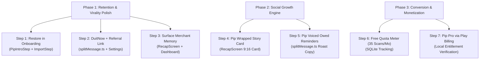

# Pip: Growth, Retention, Conversion & Virality Strategy

**Document Status**: Active Strategic Blueprint  
**Target Audience**: Founders, Core Engineers, Product Designers  
**Companion Documents**: `docs/business-plan.md`, `docs/monetization-and-marketing-plan.md`, `docs/ui-engagement-plan.md`

---

## Executive Summary

Pip has established strong local technical fundamentals:
1. **100% on-device SQLite architecture** ensuring total privacy with zero user accounts and zero cloud liability.
2. **Instant multimodal AI capture** tailored for Malaysian e-wallet screenshots (Maybank MAE, Touch 'n Go, GrabPay) and paper receipts.
3. **Localized financial superpowers** (LHDN Form BE tax relief caps, audit pack PDF exports, itemized bill splitting with 10% service charge and 6%/8% SST).

However, a personal finance app cannot scale on utility alone. This document provides a deep, evidence-based strategy addressing three core questions:
- **Retention**: How do we stop users from churning in the first 30 days and keep them logging daily?
- **Conversion**: How do we monetize sustainably without betraying the "no-account, 100% on-device" privacy promise?
- **Virality**: How do we turn single-player tracking into a peer-to-peer growth engine?

---

## 1. Analysis of the External Critique

A recent audit of Pip highlighted five key recommendations. Here is how they evaluate against the live codebase:

| Reviewer Recommendation | Reality in Codebase | Strategic Verdict |
|---|---|---|
| **1. Share the Split** | **Already Built** in `SavedScreen.tsx` & `splitMessage.ts`. | **Upgrade to v1.5**. The mechanism exists, but lacks DuitNow payment details and an app download link. |
| **2. Restore in Onboarding** | **Completely Missing** in `OnboardingScreen.tsx`. | **🚨 Top Priority (Churn Fix)**. Users reinstalling on a new phone lose their data despite backups existing. |
| **3. Nudge on Owed** | **Mechanism Built** in `OwedScreen.tsx` via `SendMessageSheet`. | **Tone Upgrade**. The button exists, but the copy is dry; needs Pip's humorous voice to remove social awkwardness. |
| **4. Shareable Recap Card ("Wrapped")** | **Missing** in `RecapScreen.tsx`. | **🔥 Top Priority (Virality)**. 692 lines of monthly math exist with zero social share affordance. |
| **5. Surface Merchant Memory** | **Calculated but hidden** (`RecapScreen.tsx:288`). | **Quick Retention Win**. Making accumulated memory visible creates an immediate switching barrier. |

### What the External Critique Missed
1. **The Shared API Quota & Abuse Ceiling**: Client-side Groq/Gemini calls will hit RPM/RPD limits under viral growth. Free scans must have a monthly cap (e.g. 35 scans/mo) paired with a **Pip Pro** tier.
2. **DuitNow Payment Friction**: In Malaysia, sharing a bill split without a DuitNow ID/QR triggers an immediate follow-up message: *"What's your bank acc / DuitNow?"*
3. **First-Time User Activation**: First-time users without old CSVs to import land on a blank screen without experiencing the AI scan magic.

---

## 2. Pillar 1: User Retention (Overcoming Financial Avoidance)

Budgeting apps globally suffer a 70% to 80% 3-day churn cliff. In personal finance, this is driven by the **Ostrich Effect**: users avoid looking at their money when spending feels stressful.

### 2.1 Pluggable Onboarding Restore (The Silent Churn Cliff)
- **Problem**: When a user switches phones and reinstalls Pip, `OnboardingScreen.tsx` treats them as a blank slate. Their years of records and streak feel lost, even though they have a local `.zip` or Google Drive backup.
- **Solution**: Add a first-screen fork:
  - *"Used Pip before? Restore your data."*
  - Single tap allows selecting a local backup ZIP or authenticating Google Drive to restore the SQLite DB and bypass setup.

### 2.2 First 60-Second "Aha!" Moment (Interactive Demo Scan)
- **Problem**: Users who have no CSV to import must manually configure budgets before ever seeing Pip's core differentiator: instant screenshot reading.
- **Solution**: Include an interactive sample receipt in Step 2 of onboarding.
  - Display a sample Touch 'n Go / Maybank receipt with a button: *"Try scanning this (3 seconds)"*.
  - Parse it instantly with a haptic celebration pop. The user feels the magic before touching a single settings toggle.

### 2.3 Habit Loops & Non-Judgmental Reinforcement
- **Reward Looking, Not Spending Less**: Maintain the philosophy that logging is always a win.
- **Surface Earned Streak Freezes**: Visually display the monthly streak freeze (`streak.ts:100`) on the dashboard: *"Pip used your monthly freeze. Your 24-day streak is safe."*
- **Visible Competence (Adaptive Merchant Memory)**:
  - Surface `merchantsKnown`: *"Pip knows 64 of your merchants. 82% of your expenses auto-fill."*
  - This turns an invisible database table into an unmistakable switching cost: leaving Pip means re-training an app from scratch.

### 2.4 Mascot Animation & Emotional Connection
- Upgrade `src/components/Pip.tsx` from static SVGs to reactive animated expressions:
  - **Proud**: Rings closed or weekly logging completed.
  - **Cheeky / Roast**: Micro-commentary on large weekend splurges.
  - **Relieved**: All pending bills settled.

---

## 3. Pillar 2: Conversion & Sustainable Monetization

Pip must monetize without violating its core architectural promise: **100% on-device, zero accounts, zero cloud servers**.

```
┌─────────────────────────────────────────────────────────────┐
│                       PIP MONETIZATION                      │
│            "Go Pro. Still no account. 100% Private."        │
└──────────────────────────────┬──────────────────────────────┘
                               │
            ┌──────────────────┴──────────────────┐
            ▼                                     ▼
   ┌──────────────────┐                  ┌──────────────────┐
   │    FREE TIER     │                  │     PIP PRO      │
   │──────────────────│                  │──────────────────│
   │ • Unlimited manual│                 │ • RM 9.90 / month│
   │ • 35 AI scans/mo │                  │ • RM 79.00 / year│
   │ • All core tools │                  │ • Unlimited scans│
   │ • Local backups  │                  │ • Savage Roast   │
   └──────────────────┘                  │ • Auto-export    │
                                         └──────────────────┘
```

### 3.1 Google Play Billing Local Entitlement
- Use Google Play Billing for Android subscriptions.
- Entitlements are tied to the device's Google Play account, verified locally via Play Billing APIs, and cached in local SQLite.
- **No Pip backend, no email signup, no login screens.**

### 3.2 Pricing & Packaging Strategy
- **Free Tier**: Unlimited manual bookkeeping, full Net Worth tracking, LHDN tax relief, and **35 AI screenshot scans/month**.
- **Pip Pro Subscription (RM 9.90/month or RM 79/year)**:
  1. **Unlimited AI Vision Scans**: Dedicated priority endpoint skipping shared free-tier queues.
  2. **Custom Mascot Persona**: Unlock "Savage Roast Mode" (Cleo-style witty spending commentary).
  3. **Automated Scheduled Backups & Reports**: Automatically compile monthly PDF/Excel statements to a local storage folder or Google Drive.
  4. **Pro Themes & Exclusive Home Widgets**.
- **Consumable Top-Up (RM 4.90 for 100 scans)**:
  - Catches users who blow past 35 scans during a busy holiday month but dislike recurring subscriptions.

### 3.3 Paywall Timing
- Never block users mid-workflow.
- When reaching **80% of the free quota** (e.g. 28/35 scans), display a soft usage meter on the Add screen: *"28/35 free scans used this month. Resets in 5 days, or unlock unlimited with Pip Pro."*

---

## 4. Pillar 3: Virality & Peer-to-Peer Growth

Fintech apps achieve word-of-mouth through **multiplayer utility** and **cultural identity**, not generic invite buttons.

### 4.1 The #1 Organic Growth Loop: The DuitNow Split Bill
When splitting a bill at a dinner, the payer shares the breakdown with 3 to 6 friends on WhatsApp.

#### The Problem with Current Implementation:
`splitMessage.ts` outputs:
```text
Pavilion Sushi: RM 120.00 paid
How this splits:
John: RM 40.00
Me (paid): RM 80.00

Split with Pip
```
Friend's immediate reaction: *"What is your bank account or DuitNow?"*

#### The Viral Upgrade:
1. Add a **DuitNow Setting** in Pip (Phone number, IC, or DuitNow QR image).
2. Automatically format outgoing split and reminder messages:
```text
Pavilion Sushi · RM 120.00
Your share: RM 40.00 (incl. 10% svc + 6% SST)

Pay me via DuitNow:
012-3456789 (Maybank / Alex Tan)

Split accurately with Pip — Zero ads, 100% private:
https://pipfinance.app
```
**Outcome**: Every bill split eliminates settlement friction while acting as an authentic recommendation.

### 4.2 "Pip Wrapped" Monthly Social Cards (Instagram Stories / WhatsApp Status)
- In `RecapScreen.tsx`, users can currently only export accounting PDFs and Excel sheets.
- Add a **"Share Monthly Recap Card"** button generating a 9:16 vertical image:
  - **Design Constraint**: **Numbers OFF, Persona ON**.
  - Users will not publicly share bank balances or raw spend numbers.
  - Instead, display:
    - Current logging streak (e.g. *"38-Day Logging Streak"*).
    - Top spending category superlative (e.g. *"Specialty Coffee Enthusiast"*, *"Boba Baron"*).
    - Month-end Pip Mascot expression + humorous roast line.
    - Watermark: `pipfinance.app`.

### 4.3 The LHDN Tax Season Wedge (March - April)
- Every March to April, Malaysian salaried workers scramble for tax relief receipts.
- Pip already generates an audit-ready tax pack (`tax-relief-audit-pack-2025.pdf`).
- Add a 1-tap shareable **Tax Relief Checklist Summary**:
  - *"I've claimed RM4,850 in lifestyle, medical, and sports tax reliefs on Pip so far. Don't leave money on the table before April 30."*

---

## 5. Technical Implementation Blueprint



### Feature 1: Restore in Onboarding
- **Files**: `src/screens/OnboardingScreen.tsx`, `src/screens/onboarding/PipIntroStep.tsx`, `src/screens/onboarding/ImportStep.tsx`
- **Logic**:
  1. Add a secondary link on `PipIntroStep`: *"Already have a backup? Restore data"*.
  2. Clicking opens a modal allowing the user to select their `pip-backup-*.zip` or connect to Google Drive via `useCloudBackup`.
  3. On successful restore, trigger `completeOnboarding()` and navigate straight to the populated Dashboard.

### Feature 2: DuitNow in Split & Reminder Messages
- **Files**: `src/lib/splitMessage.ts`, `src/screens/SettingsScreen.tsx`, `src/db/metaRepo.ts`
- **Logic**:
  1. Save user's DuitNow ID (e.g. `duitnow_recipient_id`, `duitnow_bank_name`) in settings.
  2. In `buildGroupMessage()`, `buildPersonMessage()`, and `buildOwedReminder()`, check if DuitNow info is configured and append the payment callout block.
  3. Append the canonical referral link: `https://pipfinance.app`.

### Feature 3: Surface Adaptive Merchant Memory
- **Files**: `src/screens/RecapScreen.tsx`, `src/screens/DashboardScreen.tsx`
- **Logic**:
  1. Un-hide `merchantsKnown` in `RecapScreen.tsx:288`.
  2. Add a competence card in the monthly recap:
     ```tsx
     <Card style={styles.competenceCard}>
       <Icon name="sparkles" size={18} color={theme.accent} />
       <Text>{merchantsKnown} merchants remembered</Text>
       <Caption>Pip auto-categorized your repeat visits</Caption>
     </Card>
     ```

### Feature 4: Shareable 9:16 Recap Card
- **Files**: `src/screens/RecapScreen.tsx`, `src/components/RecapStoryModal.tsx`
- **Logic**:
  1. Add a `"Share Card"` button next to the month picker.
  2. Render a 9:16 card (1080x1920 preview) showing:
     - Month title & Pip Mascot celebration.
     - Streak counter & closed week rings.
     - Top category icon and badge (amounts masked or converted to percentages).
     - Pip's witty monthly commentary.
  3. Capture using `react-native-view-shot` or SVG export and pass to `expo-sharing`.

---

## 6. Recommended Next Step

### Recommended Immediate Move: **Step 1 (Restore in Onboarding)**
**Rationale**: You have already implemented #1 (Split Sharing). Your greatest immediate risk is **silent churn** from returning users who reinstall the app or change phones. Adding a clean restore option in onboarding:
1. Plugs a data-loss hole.
2. Leverages the existing `backupRestore.ts` and `cloudBackup` engines already in the repository.
3. Takes less than 2 hours of focused UI integration.

**Follow-up Move**: Immediately proceed to **Step 2 (DuitNow in Split Messages)** to supercharge your newly built bill-splitting viral loop.
