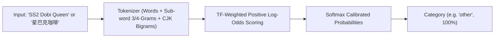

# On-Device Statistical Classifier (TF-IDF / Naive Bayes)

This folder contains the training dataset, dataset builder, and compiler for Pip Finance's on-device merchant categorization model.

---

## 1. Overview

The classifier provides **instant (<0.5ms), 100% offline, privacy-first** transaction category prediction. It acts as an intelligence layer between the keyword dictionary and remote LLM fallback.



### Key Properties:
- **Zero Dependencies**: Pure Python 3 for training (`no pip install` needed); pure TypeScript for mobile app inference.
- **Sub-word N-Grams**: Character 3-grams and 4-grams provide automatic typo tolerance (e.g., `"lauundry"` -> matches `#"lau"`, `#"aun"`, `#"und"`).
- **CJK Bigrams**: Extracts single characters and character pairs for Chinese merchants (e.g., `"星巴克"` -> `cjk:星`, `cjk:巴`, `cjk2:星巴`).
- **TF-Weighted Log-Odds**: Multiplies discriminative signal by term frequency `(1 + ln(tf)) * ln(P(t|c) / P(t|not c))` to keep high-frequency anchor merchants at the top and suppress rare noise.
- **Ultra Lightweight**: Serializes to a compact JSON file (~93 KB).

---

## 2. Directory Structure

```
tools/classifier/
├── dataset.json        # 2,296 labeled merchant and expense samples across 16 categories
├── build_dataset.py    # Dataset generator & balance enricher
├── train.py            # Model training, stratified 80/20 evaluation, and export script
├── model.json          # Compiled model artifact (local copy)
└── README.md           # Documentation
```

---

## 3. Dataset Format (`dataset.json`)

Each sample in `dataset.json` is a JSON object with:
- `text`: Merchant name, brand, or natural expense phrase (English, Malay, Chinese).
- `category`: Target category ID in Pip Finance.

```json
[
  {"text": "SS2 Dobi Queen self service", "category": "other"},
  {"text": "Starbucks Reserve pour over", "category": "food"},
  {"text": "Petronas Primax 95 fuel refill", "category": "travelling"},
  {"text": "TNB bil elektrik rumah kediaman bulanan", "category": "utilities"},
  {"text": "GSC movie ticket premiere 2D", "category": "entertainment"},
  {"text": "海底捞火锅肥牛羊肉", "category": "food"},
  {"text": "国家能源电费单", "category": "utilities"}
]
```

### Categories Supported (16 Total):
- **Expenses**: `food`, `travelling`, `shopping`, `entertainment`, `utilities`, `other`, `rental`, `phone-bill`, `subscriptions`, `medical`, `insurance`, `learning`, `family`.
- **Income**: `salary`, `allowance`, `other-income`.

---

## 4. How to Train & Export

Run the Python training script from the project root:

```bash
python3 tools/classifier/train.py
```

### What `train.py` Does:
1. Loads `dataset.json` (2,296 curated samples).
2. Performs a stratified 80% train / 20% test split and evaluates precision, recall, and accuracy across 466 unseen test samples.
3. Trains on the full dataset with Laplace-smoothed, TF-weighted log-odds.
4. Exports the compiled model to:
   - Local: `tools/classifier/model.json` (~93 KB)
   - Mobile App: `src/data/merchantClassifierModel.json`
5. Runs a multi-lingual 37-query validation battery across English, Malay, and Chinese.

---

## 5. Expanding the Dataset

To add more merchant entries or regenerate the dataset:
1. Edit `tools/classifier/build_dataset.py` or directly append to `tools/classifier/dataset.json`.
2. Run `python3 tools/classifier/build_dataset.py` (if editing the generator).
3. Run `python3 tools/classifier/train.py` to retrain and export the new model.
